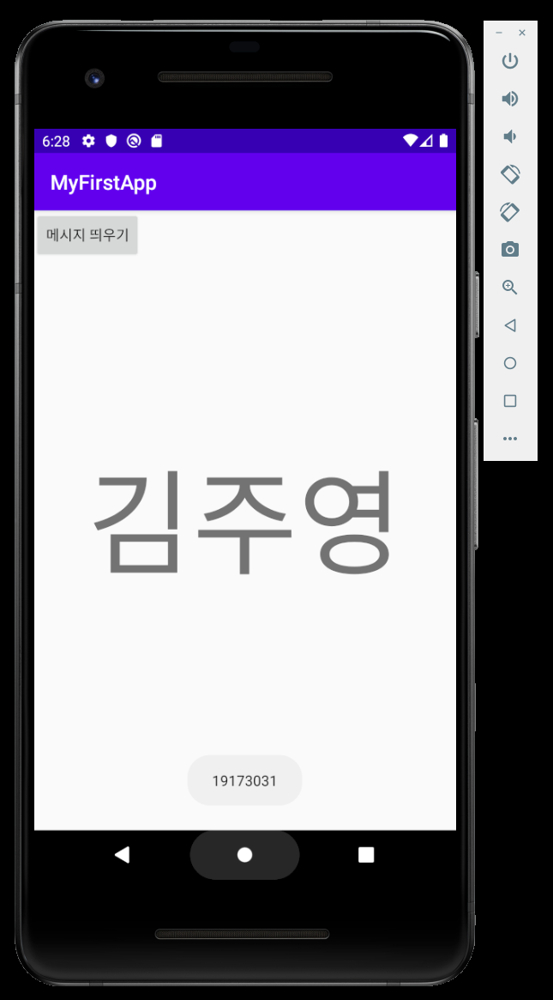
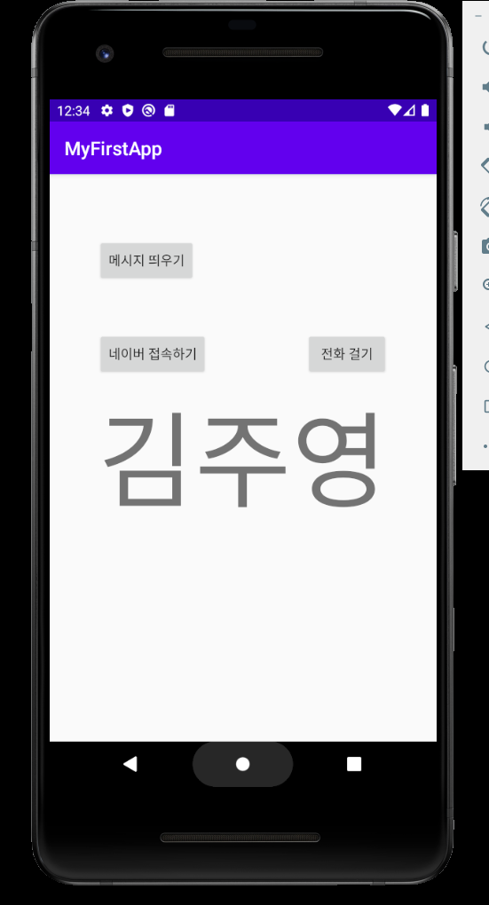
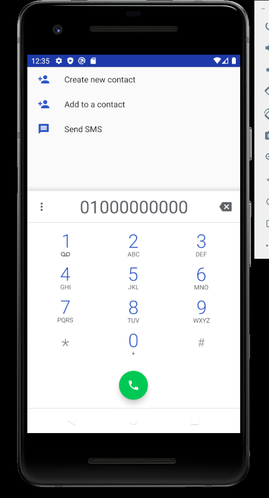
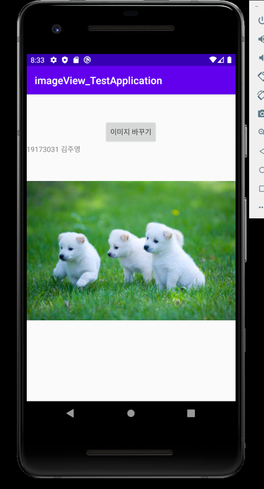
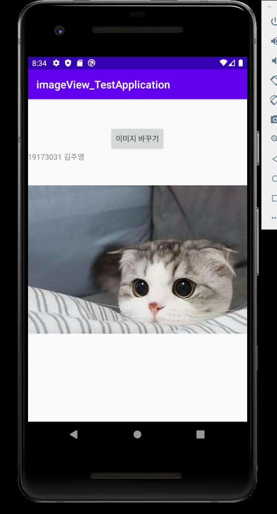

# 19173031 김주영

## 1주차 과제

## 2주차 과제
</img>

## 3주차 과제
</img>
</img>
</img>

---

## 4주차 과제
### 캘린더에 노트의 기능을 결합한 앱
- 우리는 효율적인 **일정 관리**를 위해 캘린더를 작성하고, 잊어버리지 않기 위해 **기록**함
- 기존 캘린더앱의 경우 대부분 일정 및 할 일 등록 시 간편 메모 기능을 지원하긴 하지만, 할 일 확인 시 이해도를 높이기 위해 사진 등록 등의 상세한 기록이 불가능하다는 아쉬움이 있었음

#### 목표
  - 캘린더에 노트의 장점인 글, 사진 등록, 그림 그리기 요소 등의 결합을 통해 상세한 기록에 도움을 줌으로써 사용자의 **더 나은 일정 관리**를 지원하려 함

#### 타겟
  - 효율적인 일정관리를 원하는 사람
  - 캘린더와 노트 앱을 따로 사용하는 사람
  - 캘린더의 간편 메모 기능이 아쉬웠던 사람

#### 기존 앱과 구분되는 특징
  - 등록한 일정 및 할 일에 대해 글, 사진 등록, 그리기 등 자유로운 방식으로 상세하게 기록할 수 있어 상세한 할 일 기록뿐만 아니라 일기장, 아이디어 노트, 필기 노트 등으로 활용할 수 있음
  - 캘린더 및 메모를 여러 앱에 작성하는 번거로움 없이 효율적으로 이용할 수 있음
  - 등록한 메모는 일정, 할 일과 함께 출력되어 한 눈에 확인할 수 있음
  

---
## 7주차 과제
</img>
</img>
